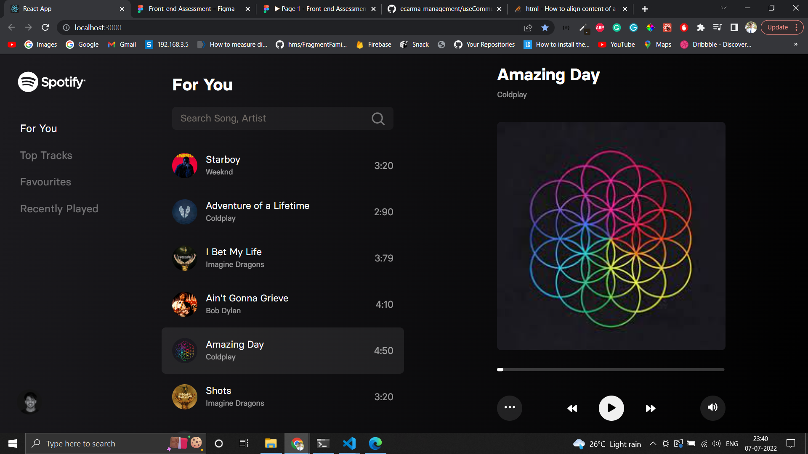

# Samespace Assignment

## Start Server

- To start the server run the following commands from the project root directory.

```
yarn
yarn start
```

Then click here to navigate to the [site](http://localhost:3000/)

## Libraries Used

- <b>classnames</b> - Use multiple module classnames object for styling single element

- <b>colorthief</b> - To retrieve dominant color of the image

- <b>graphql</b> - To make queries and mutations to graphql server

- <b>lodash</b> - To get debounce function to debounce the search query.

- <b>react-icons</b> - Use Icons SVG.



## Some of the pending tasks

- UI is not responsive it is designed according to the figma screen layout provided.

## Thank you for your patience.
